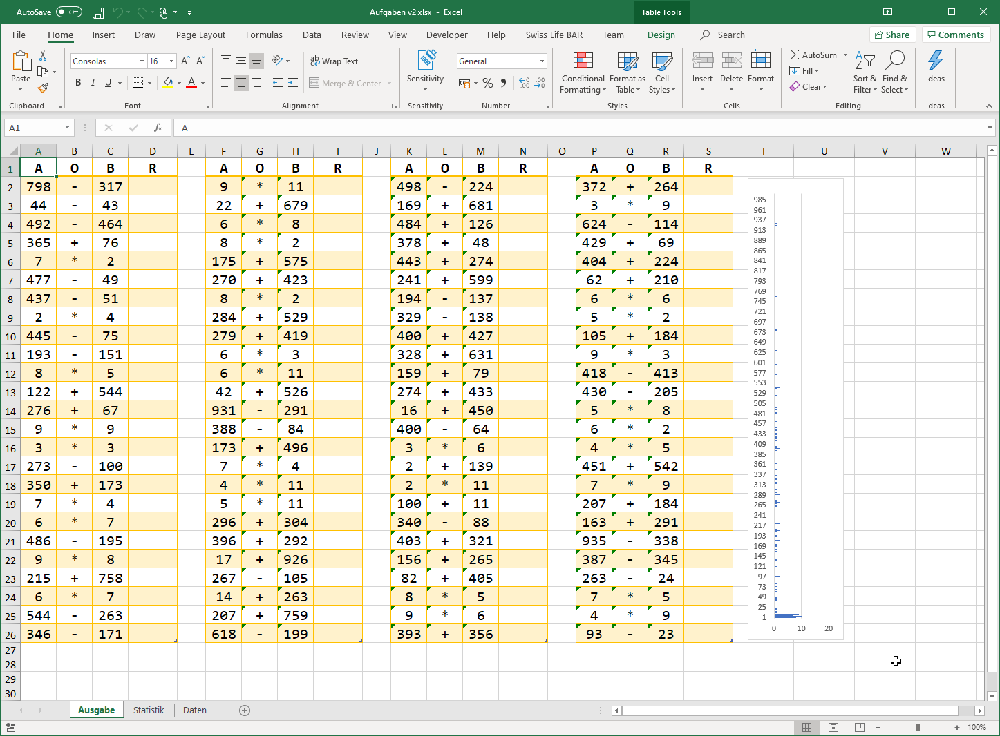

# Rechenaufgaben Generator
Dieses simple tool generiert Zufallszahlen für Unterstufen-Rechenaufgabenblätter.
Es werden jeweils 100 Rechenaufgaben in ein Json-File generiert, welches sich als Datasource
an ein Excel-Sheet binden lässt.



Mit einem Titel versehen lässt sich das Excel-Sheet dann natürlich drucken und den Sprösslingen zwecks Übung überlassen. Für die etwas faulen Eltern findet sich im Tab "Daten" auch noch gleich die entsprechende Lösung.

## Schwierigkeitsgrad einstellen
Je nach Klasse lassen sich die Zahlenbereiche der Rechnungsaufgaben sowei auch die Art der Rechnungen, die generiert werden, einstellen. Der komplette Code findet sich in `Rechenaufgaben/Program.cs`, die Konfiguration erfolgt direkt im Code.

1. Art der Rechenaufgaben
Der Funktion `CreateAufgabenFile` übergibt man nach der Anzahl der zu generierende Rechnungen die Funktionen, welche die eigentlichen
Rechnungen generieren. Da es sich um ein params-Parameter handelt, kann man da mehr oder weniger Rechnungsgeneratorfunktionen einbinden.
```cs
var aufgabenFile = CreateAufgabenFile(100, GetPlusRechnung, GetMinusRechnung, GetMalrechnung);
```

2. Zahlenraum festlegen
In der Funktion `` kann man die Zahlenräume pro Rechnungsart festlegen. Grössenordnungen sind:
   1. Klasse: Plus, Minus von 0-20
   2. Klasse: Plus, Minus, Mal von 0-100
   3. Klasse: Plus, Minus, von 0-1000, Mal von 0-12, später noch Divisionen

Jeder Aufruf soll 2 Operanden per Zufall zurückgeben. Für Subtraktionen sollte der zweite Operand kleiner sein als der erste. Negative
Zahlen kommen erst später.
```cs
private static (int A, int B) GetOperatorsByRechnungtyp(Func<int, int, Rechnung> factory)
{
    int a;
    int b;

    if (factory == GetMalrechnung) {
        a = GetRandom(2, 10);
        b = GetRandom(2, 12);
        return (a, b);
    }
    if (factory == GetPlusRechnung) {
        a = GetRandom(2, 500);
        b = GetRandom(2, 1000-a);
        return (a, b);
    }

    // Minusrechnung
    a = GetRandom(2, 500);
    b = GetRandom(2, 1000);
    return (a, b);
}
```

## Rechnungsblässter generieren
Das Program basiert auf Dotnet-Core 3.1 und lässt sich einfach in einer Console oder direkt in der IDE starten.

```sh
git clone https://github.com/thomas-mutter/mutter-rechenaufgaben
cd mutter-rechenaufgaben/Rechenaufgaben
dotnet run
```

Das Programm generiert nun 20 Json-Files mit je 100 Rechenaufgaben im Verzeichnis Aufgaben.

## Rechnungsblätter erstellen
Das Excel-Sheet dient als Vorlage und hat das Json-File aufgaben.json als Datasource eingebunden. Man kann nun einfach
eines der generierten Json-Files entsprechend kopieren und im Excel-Sheet die Datenquelle aktualisieren, schon hat man ein
neues Rechnungsblatt.
**Achtung** zur Zeit funktioniert diese PowerQuery-Funktionalität zum Anbinden von Json-Files offenbar nur unter Windows.
